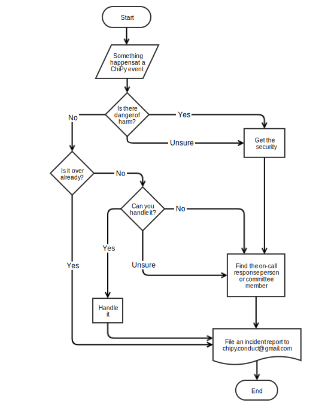

:point_left: [Come back to index](README.md)

# Chicago Python User Group(ChiPy) Code of Conduct

## Incident response guide

This document aims to present the way ChiPy handles received reports. This is
not a complete guide, but a set of guidelines and best practices that guide the
way we provide support to the community. Each issue is different and requires
individual consideration on a case-to-case basis.

### Procedure

The intent of incident response is to provide a guideline for how to
respond to Code of Conduct issues while they are happening.
Regardless of the severity of the incident, a report should be
sent via [conduct hotline] as soon as is convenient.

1. If there is immediate danger or you are unsure, contact
   security or local law enforcement.
2. If the incident is ongoing and you want to resolve it now,
   alert a member of the ChiPy Code of Conduct committee.
3. Otherwise just send an incident report as soon as is convenient.
   Responses will be handled according to the
   [Report Handling Procedure](./report-handling-procedure.md)

### Example scenarios

#### Taking Reports

When taking a report from someone experiencing harassment you should
record what they say and reassure them they are being taken seriously,
but avoid making specific promises about what actions the organizers
will take.

Ask for any other information if the reporter has not volunteered it
(such as time, place) but do not pressure them to provide it if they
are reluctant. Even if the report lacks important details such as the
identity of the person taking the harassing actions, it should still be
recorded and passed along to the appropriate staff member(s). If the
reporter desires it, arrange for an escort by conference staff or a
trusted person, contact a friend, and contact local law enforcement.

Do not pressure the reporter to take any action if they do not want to do it.
Respect the reporter's privacy by not sharing unnecessary details with others,
especially individuals who were not involved with the situation or non-staff members.

Reports should be sent to the [conduct hotline] as soon as practical.
The report should include as much of the following as you can remember:
- Identifying information (name/badge number) of the participant
- The time the incident was reported
- The behavior that was in violation
- The approximate time of the behavior (if different than the time of reporting)
- The circumstances surrounding the incident
- Your identity
- Other people involved in the incident

#### Warnings

Any member of the Chipy Code of Conduct Committee can issue a verbal warning
to a participant that their behavior violates ChiPy’s code of conduct.
Warnings should be logged via an email to the [conduct hotline] as
soon as practical.
The report should include as much of the following as you can remember:

- Identifying information (name/badge number) of the participant
- The time you issued the warning
- The behavior that was in violation
- The approximate time of the behavior (if different than the time of warning)
- The circumstances surrounding the incident
- Your identity
- Other people involved in the incident

#### Presentations

Presentations or similar events need not be stopped for one-time gaffes
or minor problems, although one of the Chipy Code of Conduct Committee
should speak to the presenter afterward. However, a committee member
should take immediate action to politely and calmly stop any
presentation or event that repeatedly or seriously violates the
Code of Conduct.  For example, simply say *"I'm sorry, this presentation
cannot be continued at the present time"* with no further explanation.

[conduct hotline]: https://conducthotline.com/e/chipy
